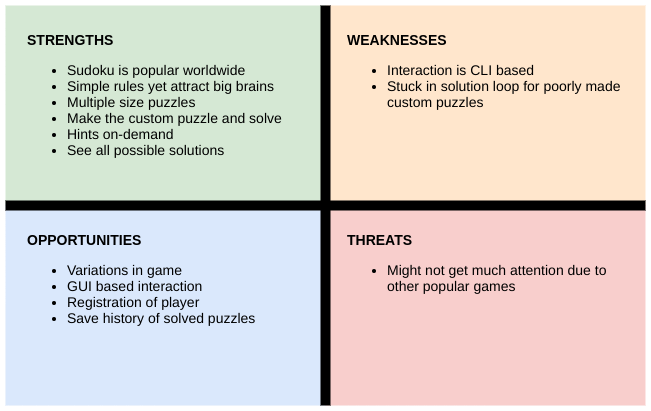

# Requirements

## Introduction
 [Sudoku](https://en.wikipedia.org/wiki/Sudoku) game is popular worldwide and due to its simplicity, player of any age can enjoy solving it. As an engineer, I spend most of my time in development of things and hence on terminal. So I decided to make a command line interface for playing Sudoku to take short yet productive and joyful breaks.

 Implementing it in C programming language will help me learn best practices of doing things and understand the multi-file programming, SDLC, testing & debugging tools, and automations tools better.

 * For unit testing, I will use [Unity](http://www.throwtheswitch.org/unity) framework.
 * For static code analysis, I will use [Cppcheck](https://github.com/danmar/cppcheck).
 * For memory leak detection, I will use [Valgrind](https://valgrind.org/).
 * For automation of building, testing and other processes, I will use[Makefile](https://www.gnu.org/software/make/manual/make.html).
 * For source control managing, I will use Git and Github leverging its various functionalities like Github Issues, Actions, Projects, etc.

## Research
Initially Sudoku puzzles were mostly available to play on newspapers, magazines, etc. But with advancing technologies, now we can play it on several apps and websites. It only requires thinking capability from the player. Despite being a simple board game with only few rules, it attracts many big brains across the world because there are many variations available in this game.

Many projects are just providing the Sudoku solver functionality. There are many computer algorithms available for solving sudoku but the joy of solving on your own is of another level. So apart from making just a sudoku solver like others I will be making a better cli form of playing sudoku with on demand help from the solver.

### Benefits
Playing games are very helpful in increasing concentartion level. Sudoku even helps in strengthening memory power.

Apart from the above benefits, solving Sudoku has always been a source of fun and a thing to brag about if one can compete with world champions. Yes, you read right, there is also a world championship of solving Sudoku!

## Cost and Features with Time
* There is no cost involved in playing Sudoku game and just need one's  dedication to solve various puzzles or time to spend joyfully.
* With time ony the sudoku solving algorithms have evolved from very naive brute force to recursive backtracking and others.
* Most of the services take partially completed sudoku from the user and generate the solution.

## Defining Our System
* Menu to play computer generated puzzle or input custom puzzle.
* Computer generated puzzle:
    * Take size of the puzzle as input.
    * Take row, coloumn and value as input to fill.
    * Get a random hint on demand.
    * Check for validity of board on finish and output result.
    * Can check for all possible solutions.
* Custom puzzle:
    * Take size of the puzzle as input.
    * Take number as input to set custom board.
    * Check for validity of board.
    * Solve by yourself or get solution from the solver.
* Option to save progress of current puzzle.

## SWOT ANALYSIS

# 4W's and 1'H

## Who:
* Player of any age group can play Sudoku.
* Developers working on their terminal can take break by playing Sudoku.

## What:
* Sudoku is a brain teaser game, originated in Japan. This program gives a platform to play Sudoku on your terminal.

## When:
* This project is part of LnT STEPin SDLC Activity Based Learning.

## Where:
* This Sudoku game can be played on any desktop environment.

## How:
* Written in C Programming language using VSCode in linux environment.

# Detail requirements

## High Level Requirements: 
| ID   | Description | Category | Status |
|------|-------------|----------|--------|
| HR01 | --          | --       | --     |

##  Low level Requirements:
| ID   | Description | HLR ID | Status |
|------|-------------|--------|--------|
| LR01 | --          | HR01   | --     |