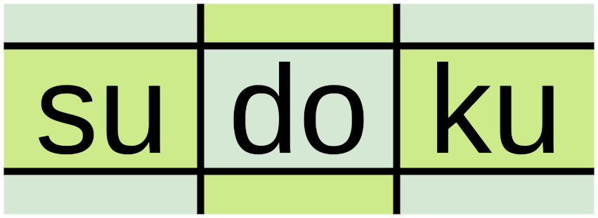

<!-- banner -->

<!-- project title -->
# Sudoku Game

<!-- badges -->

<!-- project details -->
This project is part of LnT STEPin SDLC Activity Based Learning. The objective is to apply SDLC, use multi-file programming, do unit testing, use Git and other task automation tools.

Sudoku is a logic-based, combinatorial number-placement puzzle. In classic sudoku, the objective is to fill a 9×9 grid with digits so that each column, each row, and each of the nine 3×3 subgrids that compose the grid contains all of the digits from 1 to 9. The puzzle initially provides a partially completed grid, which for a well-posed puzzle has a single solution.

This project written in the C programming language provides an interface for playing the Sudoku game. For more details on the project read the [requirements](1_Requirements/Readme.md) and [design](2_Design/Readme.md) docs. For building the project refer to the [implementation](3_Implementation/Readme.md) doc. 

<!-- folder structure -->
## Folder Structure
| Folder              | Description                                   |
|---------------------|-----------------------------------------------|
| `1_Requirements`    | Documents detailing requirements and research |
| `2_Design`          | Documents specifying design details           |
| `3_Implementation`  | All code and documentation                    |
| `4_Test_plan`       | Documents with test plans and procedures      |
| `6_ImagesAndVideos` | Project images and videos                     |

<!-- list of contributers -->
## Contributors List and Summary

| SF Id.   | Name        | Features |
|----------|-------------|----------|
| `258661` | Rishu Anand | F_01     |

| Feature Id | Feature |
|------------|---------|
| F_01       | --      |

<!-- problems faced and their solutions -->
## Challenges Faced and How Was It Overcome

| No. | Challenge                                   | Solution                                                                                                                                                                                                                                                                                    |
|-----|---------------------------------------------|---------------------------------------------------------------------------------------------------------------------------------------------------------------------------------------------------------------------------------------------------------------------------------------------|
| 1.  | Understanding symbols used in UML diagrams. | Found [Visual Paradigm](https://www.visual-paradigm.com/guide/) guide very helpful for learning types of UML diagrams and symbols used in them.  Found [diagrams.net](https://www.diagrams.net/) or [draw.io](https://www.draw.io/) very easy to use and free tool to make UML diagrams. |
